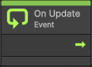
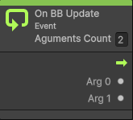
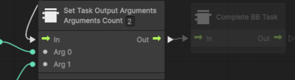

# VS-BB
Bi-directional integartion between Unity's Visual Scripting and Pada1's BehaviourTree
# Table of Contents
- [VS-BB](#vs-bb)
- [Table of Contents](#table-of-contents)
- [Introduction](#introduction)
- [Installation](#installation)
- [Usage](#usage)
  - [Run a Behaviour Tree from a Visual Scripting Graph](#run-a-behaviour-tree-from-a-visual-scripting-graph)
  - [Run a Visual Scripting Graph from a Behaviour Tree](#run-a-visual-scripting-graph-from-a-behaviour-tree)
    - [Script Machines to be used as Behaviour Tree's leaf nodes](#script-machines-to-be-used-as-behaviour-trees-leaf-nodes)
- [Hello World](#hello-world)

# Introduction
This project is a bi-directional integration between Unity's Visual Scripting and Pada1's BehaviourTree. The goal is to allow the user to create a behaviour tree in Pada1's BehaviourTree and then run it from within a Visual Scripting graph in Unity. An to run Visual Scripts "coded" in VS as a Behaviour Tree's leaf node.

# Installation

1. Get Behavior Bricks from [Unity's Assets Store](https://assetstore.unity.com/packages/tools/visual-scripting/behavior-bricks-74816)  
and add it to your account.
Then add the package into your project   
and import it into your project.

2. Get Visual Scripting from [Unity's Package Manager]() and import it into your project.

3. Get the latest release of this project from [releases](https://github.com/borjacano97/VS-BB/releases) and import it into your project.  

4. Regeneate the Visual Scripting Nodes. To do so: go to `Project Settings > Visual Scripting > Regenerate Nodes` and click on `Regenerate Nodes`. 
5. You are ready to go! 🎉🎉

# Usage

## Run a Behaviour Tree from a Visual Scripting Graph

1. Open the Visual Scripting Graph Editor.
2. Add the node `BehaviourTree Executer` to the graph.

3. Drag and drop the Behaviour Tree asset you want to run into the `Behaviour` field. 
4. You **must** connect to flow input of the `BehaviourTree Executer` node to a `On Update` () flow node. It can have as many nodes as you want in between, but the flow must reach the `BehaviourTree Executer` node each frame to work as it does on a normal BT.
5. The `BehaviourTree Executer` node has two outputs by default:
	- `Task RUNNING`: This output will be triggered while the Behaviour Tree has not finished executing.
	- `Task COMPLETED`: This output will be triggered when the Behaviour Tree has finished executing.
  
6. If the Behaviour attached had a blackboard with parameters as In/Out the node will auto detect those, and will create the corresponding entry and exit points for them (`Count` on the example above). You can connect them to the rest of the graph as you would with any other parameter.

## Run a Visual Scripting Graph from a Behaviour Tree

1. Open the Visual Scripting Executor generator on `Window > Behaviour Bricks > Create New Visual Scripting Executor`.
2. Fill the fields with the desired information.
   - Script Machine or State Machine
   - Name of the Visual Scripting Graph
   - Action path: The path of the executor in the Behaviour Brick's editor.
   - Help: A brief description of the executor.
   - Input parameters: Number of input parameters the executor will have.
     - Type: The type of the input parameter.
     - Name: The name of the input parameter.
   - Output parameters: Number of output parameters the executor will have.
	 - Type: The type of the output parameter.
	 - Name: The name of the output parameter.
    - Output Directory (Optional): The directory where the executor will be saved.
3. Click on `Generate`.
4. Now you've created a custom node for your Behavior Tree to execute your Script/State Machine under the name you have provided. You now can find it in the Behaviour Brick editor at the `ActionPath` you have provided.
5. Select the new node on the BB editor, go to Parameters and click on `Machine` input parameter, select `BlackBoard`, give it a name and click on `Create`.
6. Add a new Script/State Machine component to the GameObject that has the Behaviour Tree, and add the Visual Scripting Graph you want to run to it.
7. Drag and drop the Component to the `Machine` input parameter in the `Behaviour Executor Component`'s `BlackBoard`.

### Script Machines to be used as Behaviour Tree's leaf nodes
The script machines that are going to be used as leaf nodes in the Behaviour Tree must have special requirements:
- The Script Machine (or Start Script Machine in the case of State Machines) must have a `On BB Update` node () and use the flow from that node as the main Flow.
- If the Script Machine has input parameters, the input parameters count must be set on the `On BB Update` node. Once the number of input parameters is set, the node will display a series of Arguments to use as parameter inputs. The order of the arguments is the same as defined on the Generator.
- Then the Task ends, the flow must end on one of the following nodes:
  - `Complete BB Task`: This node will end the task as <u>completed</u>.
  - `Abort BB Task`: This node will end the task as <u>aborted</u>.
  - `End Failed Task`: This node will end the task as <u>failed</u>.
  - `Suspend BB Task`: This node will <u>suspend</u> the task.
  - `Resume BB Task`: This node will <u>resume</u> the task.
- Before ending the task on one of the previous nodes, the Script Machine must set the output parameters of the task (if any). To do so, you must use the `Set Task Output Arguments` node (). This node **must** have as many arguments as defined on the Generator. The order of the arguments **must** the same as defined on the Generator.

> ⚠ **WARNING** ⚠: The Script Machine must have the **same number** of input parameters as defined on the Generator. **<u>No checks are done to ensure this</u>**, so make sure the number of input parameters is correct.

> ⚠ **WARNING** ⚠: **No type checking** is done on the input nor output parameters . Make sure the input parameters are of the correct type.

# Hello World
You can find a simple Hello World example in [this repository](https://github.com/borjacano97/HelloWorld-VS_BB) .